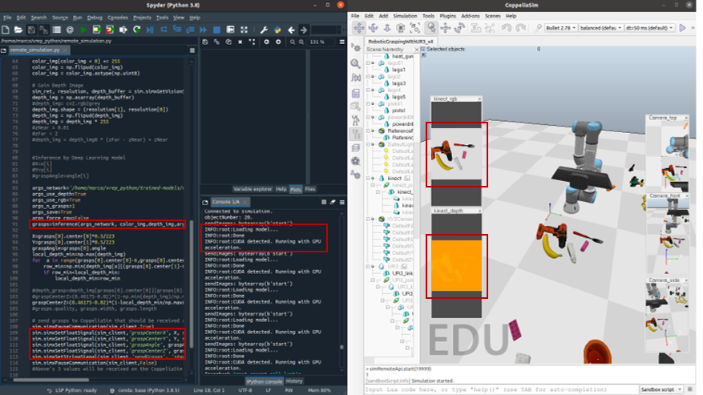

# Robotic Grasping Simulation based on CoppeliaSim
To verify/test the performance of rectangle-represented grasp detection algorithms, this project builts a joint simulation environment in CoppeliaSim (Vrep) based on the UR3 robot, RG2 gripper and a RGB-D camera.   

This is an easy-to-use framework if you wanna start your journey in robotic grasping, either validating/testing your rectangle-represented grasp detection algorithms or forking the algorithm that I used. If you have any problems, please report issues or ask me directly by email. I'm glad to see there are few forks of this repository, please star it if u like and cite this GitHub project and reference as **Citing** section below.

**Author**: [Marco Yangjun Liu](https://github.com/RealMarco/), marcoliu@nuaa.edu.cn  
**Affiliation**: Institute of Precision Drive and Control, State Key Laboratory of Mechanics and Control of Mechanical Structures  




## Requirements  
A python interpreter, PyTorch, CoppeliaSim (Vrep).  

To use the remote API functionality of Legacy Client in your Python script, you will need following 3 items:  
- sim.py  
- simConst.py  
- remoteApi.dll, remoteApi.dylib or remoteApi.so (depending on your target platform)  

Above files are located in CoppeliaSim's installation directory, under programming/remoteApiBindings/python. 

To connect coppeliasim with ROS
- libsimExtROSInterface.so   in CoppeliaSim_root
- libv_repExtRosInterface.so   copy it into each of the worker directories from the utils directory

## Instructions  
Object models come from YCB model and object set - http://www.ycbbenchmarks.com/object-models/   

0. Install all the dependencies under requirements.txt to anaconda (recommended, system python environment or other virtual python environment is fine)   
1. Open CoppeliaSim and any python interpreter under anaconda  
2. import the scene file RoboticGraspingWIthUR3_v4.ttt into CoppeliaSim  
3. Type simRemoteApi.start(19999) in the Lua command line at the bottom of the CoppeliaSim page to start the Legacy server  
4. Execute the file remote_simulation.py in python interpreter to detect the capture position, angle, etc. and instruct the server side to capture.  

P.S.  
remote_simulation.py loads the trained GR-convNet model to detect the grasping position and pass the relevant information to the server side to guide the grasping;  
RoboticGraspingWIthUR3_v4.ttt internal UR3 child script implements the control and grasping of the robotic arm  

## 中文使用说明 (Chinese Instructions)
物体模型来源 YCB model and object set - http://www.ycbbenchmarks.com/object-models/  

0、安装requirements.txt下的所有依赖包到anaconda（建议，系统python环境或其他虚拟python环境也可）  
1、打开CoppeliaSim和anaconda下的任一python编辑器  
2、将场景文件RoboticGraspingWIthUR3_v4.ttt导入CoppeliaSim  
3、在CoppeliaSim页面最下方的Lua命令行中输入simRemoteApi.start(19999)，启动Legacy服务端  
4、在python编辑器中执行文件remote_simulation.py，检测抓取位置、角度等，指导服务端抓取。  
  
P.S.   
remote_simulation.py 加载训练好的GR-convNet模型检测抓取位姿，并将相关信息传递给服务端指导抓取；  
RoboticGraspingWIthUR3_v4.ttt内部的UR3 child script实现机械臂的控制与抓取

## Results
[Sample video for multi-object robotic grasping in unstructured scenario](https://github.com/RealMarco/RoboticGraspingSimulation/blob/main/multi-object%20Grasping%20Simulation.mp4)

## CoppeliaSim-ROS based Simulation
To be updated

## Citation  
The GR-ConvNet used in this software is proposed and described in the paper *Antipodal Robotic Grasping using Generative Residual Convolutional Neural Network* and its [GitHub respiratory](https://github.com/skumra/robotic-grasping). Plz cite Kumra's paper if you are using that Deep Learning model.  

If you are using this Robotic Grasping Simulation code, please add the following citation to your publication:
```
@misc{liu2021rgs,
  author = {Yangjun Liu},
  title = {Robotic Grasping Simulation based on CoppeliaSim},
  year = {2021},
  publisher = {GitHub},
  journal = {GitHub Repository},
  howpublished = {\url{https://github.com/RealMarco/RoboticGraspingSimulation}}
}
```

or cite it as https://www.wikihow.com/Cite-a-GitHub-Repository.

## Further Development
If you are going to improve the simulation code with more functions, please refer to https://www.coppeliarobotics.com/helpFiles/  
Welcome to pull requests so that we could collaborate on this project and make it better.
